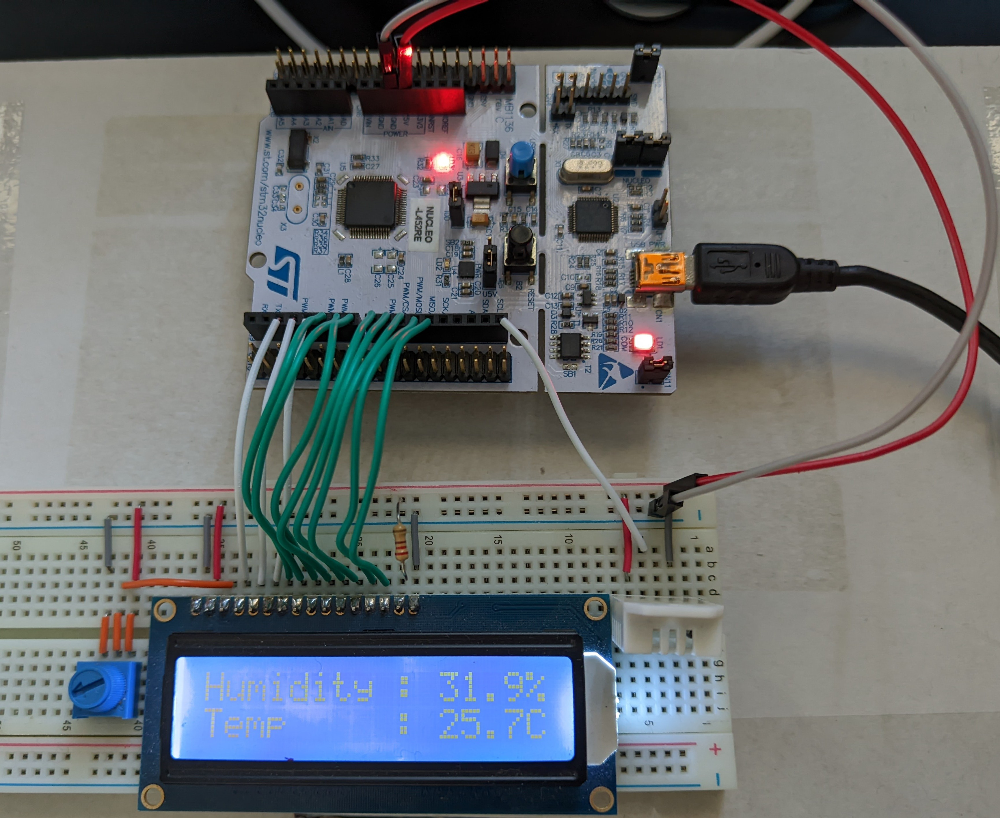

# TempSensor
Firmware written in C++20 that displays the temperature and humidity on a 16x2 LCD

* STM32 L452RET6
* RHT03
* TC1602A-09T

# Design

* [LCD module](docs/LCD.md)

# Build

To build the firmware, you need:
* [GNU Arm Toolchain 14.1](https://developer.arm.com/downloads/-/arm-gnu-toolchain-downloads)
* [Ninja 1.12.1](https://community.chocolatey.org/packages/ninja)
* [CMake 3.31.5](https://community.chocolatey.org/packages/cmake)
* VS Code
  * [CMakeTools extension](https://marketplace.visualstudio.com/items?itemName=ms-vscode.cmake-tools)

1. In VS Code, configure CMake to build for release
2. Hit `F7` to build
   * If that doesn't work, press `Ctrl+Shift+P`, type `CMake: Build` and press enter

Use STM32CubeProgrammer to flash the `elf` file in `build/release`

# 5V Tolerant Pins
| Digital Pin | Port & Pin | 5V Tolerant? |
| ----------- | ---------- | ------------ |
| D0  | PA3  | N |
| D1  | PA2  | Y |
| D2  | PA10 | Y |
| D3  | PB3  | Y |
| D4  | PB5  | Y |
| D5  | PB4  | Y |
| D6  | PB10 | Y |
| D7  | PA8  | Y |
| D8  | PA9  | Y |
| D9  | PC7  | Y |
| D10 | PB6  | Y |
| D11 | PA7  | Y |
| D12 | PA6  | Y |
| D13 | PA5  | N |
| D14 | PB9  | Y |
| D15 | PB8  | Y |

# References
https://github.com/sparkfun/SparkFun_RHT03_Arduino_Library

https://github.com/adafruit/DHT-sensor-library

https://dlnmh9ip6v2uc.cloudfront.net/datasheets/Sensors/Weather/RHT03.pdf

https://cdn-shop.adafruit.com/product-files/181/p181.pdf
