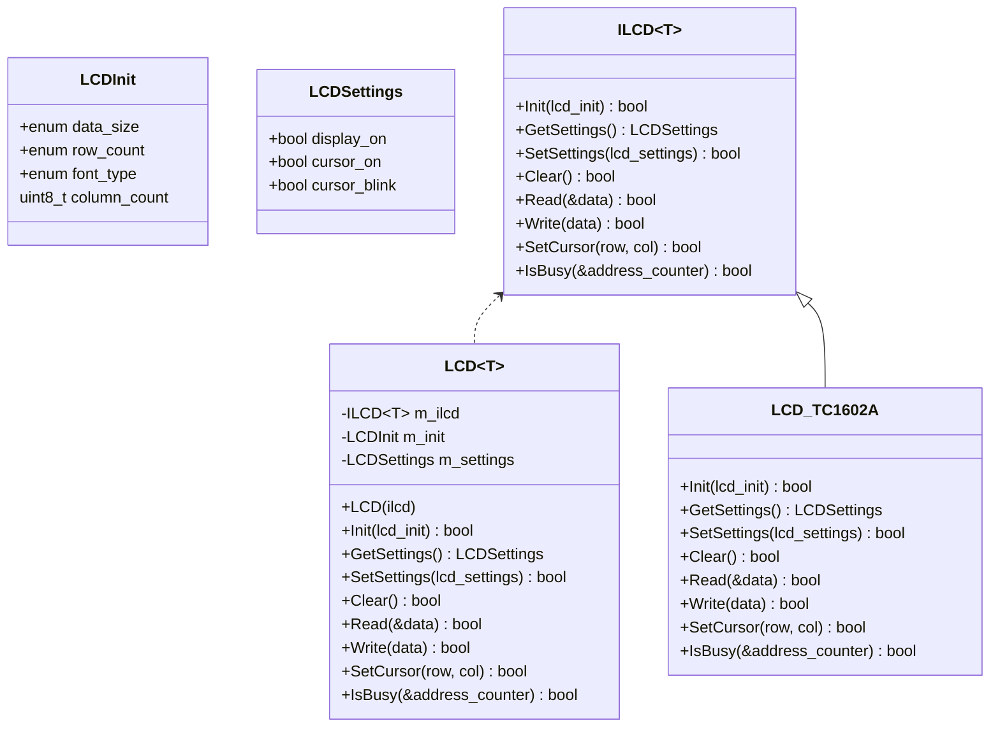

# LCD

[Datasheet (TC1602A-09T)](https://cdn-shop.adafruit.com/product-files/181/p181.pdf)

## Commands

This LCD has 2 command types indicated by the register select bit:
* 0: Instruction
* 1: Data

Additionally, you can specify the IO direction, indicated by the read write bit:
* 0: Write
* 1: Read

Refer to p10 of the datasheet for the list of commands.

## Initialisation

The LCD will automatically initialise on bootup.

The data size (4 or 8 bits), number of lines and character font must be set during this phase. They can not changed after.

## Polymorphism using CRTP



`ILCDBase<T>` uses CRTP to achieve polymorphism. The concrete implementation (`LCD_TC1602A`) will inherit this base class and implement all of the functions. This allows the interface (`ILCDBase<T>`) to use the concrete implementation (`LCD_TC1602A`).

## Type Erasure

```cpp
template<typename T>
class ILCDBase
{
public:
    void Init(const LCDInit& init)
    {
        return Impl().Init(init);
    }
    // ...

private:
    T& Impl()
    {
        return *static_cast<T*>(this);
    }
};

class ILCD
{
public:
    template<typename T>
    explicit ILCD(ILCDBase<T>& ilcd_base)
    {
        m_ilcd_base_ptr = &ilcd_base;
        auto impl = +[](void* this_ptr) { return *static_cast<ILCDBase<T>*>(this_ptr); };
        m_init = +[](void* this_ptr, const LCDInit& init) { impl(this_ptr).Init(init); };
        // ...
    }

private:
    void* m_ilcd_base_ptr;
    using init_fn = void(*)(void*, const LCDInit&);
    init_fn m_init;
}

class LCD_TC1602A : ILCDBase<LCDImpl>
{
    bool Init(const LCDInit& init)
    {
        // ...
    }
    // ...
};
```

The issue that comes with CRTP is that you will need to make `LCD` a templated class since you don't know what `T` is.

To solve this, we can use type-erasure which will convert the object pointer to `void*`. We store the address of the concrete implementation's object and the function pointer (note the extra `void*` parameter). We can use some template magic to capture `T` in the constructor, allowing us to call `T::Init()`. This is the `ILCD` class.

We can then inject `ILCD` into `LCD` which means `LCD` only relies on the interface rather than the concrete implementation. This will allow us inject a fake `ILCD` during unit tests.

`ILCD` and `LCD` could be merged but I wanted to keep the boilerplate code outside of the `LCD` class.

This becomes very tedious to maintain as you will need to implement the function 3 times (`ILCDBase`, `ILCD` and the concrete class).  
I have opted to making `LCD` a template class which would mean more code space is used but that is not a concern for now.