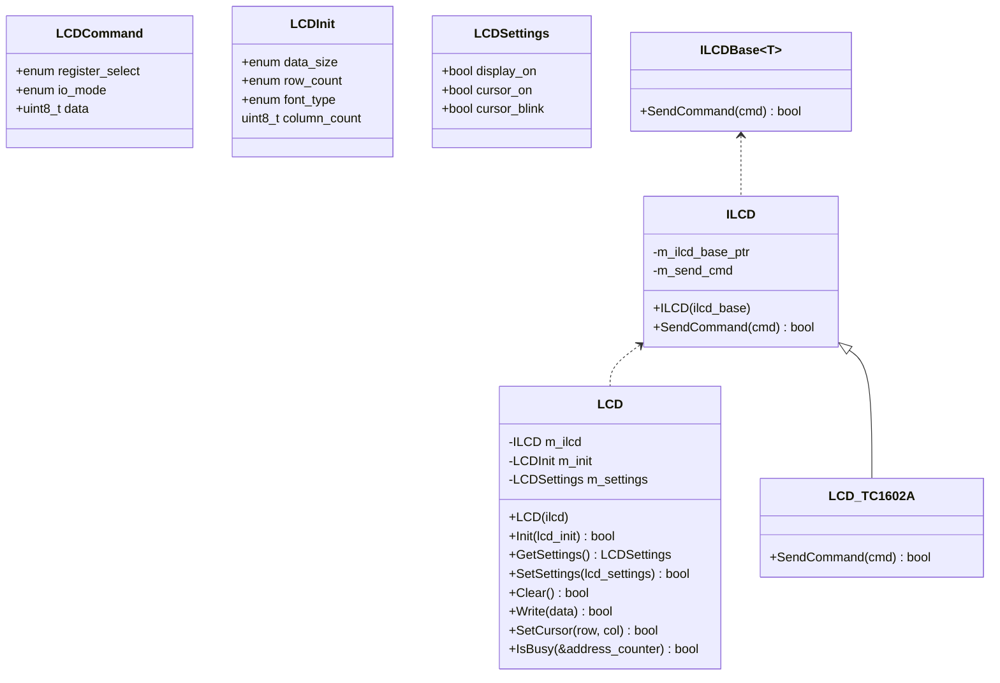

# LCD

[Datasheet (TC1602A-09T)](https://cdn-shop.adafruit.com/product-files/181/p181.pdf)



`ILCDBase<T>` uses CRTP to achieve polymorphism. The concrete implementation (`LCD_TC1602A`) will inherit this base class and implement `SendCommand()`. This allows the interface (`ILCDBase<T>`) to use the concrete implementation (`LCD_TC1602A`).

```cpp
template<typename T>
class ILCDBase
{
    bool SendCommand(const LCDCommand& cmd)
    {
        return static_cast<T*>(this)->SendCommand(cmd);
    }    
};

class LCD_TC1602A : ILCDBase<LCDImpl>
{
    bool SendCommand(const LCDCommand& cmd)
    {
        // ...
    }
};
```

The issue that comes with this approach is that you will need to make `LCD` a templated class since you don't know what `T` is.

To solve this, we can use type-erasure and store the object pointer and function pointer. We can use some template magic to capture `T` in the constructor, allowing us to call `T::SendCommand()`. This is the `ILCD` class.

We can then inject `ILCD` into `LCD` which means `LCD` only relies on the interface rather than the concrete implementation. This will allow us inject a fake `ILCD` during unit tests.

`ILCD` and `LCD` could be merged but I wanted to keep the boilerplate code outside of the `LCD` class.